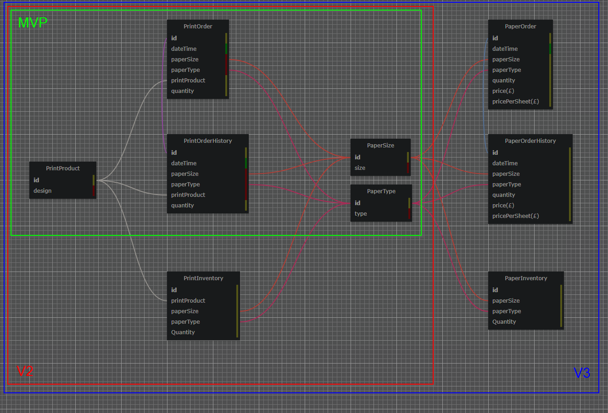
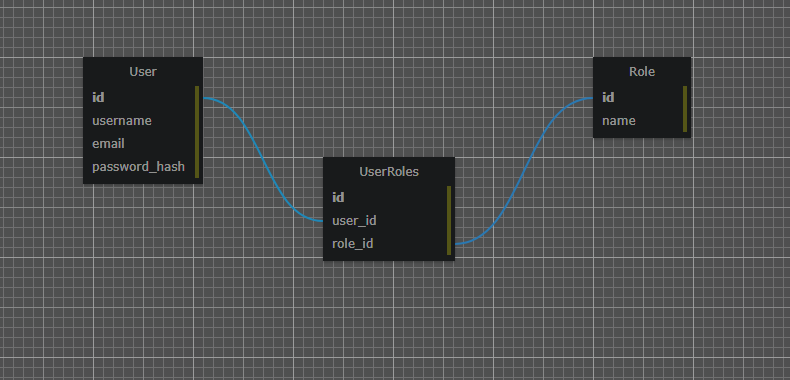
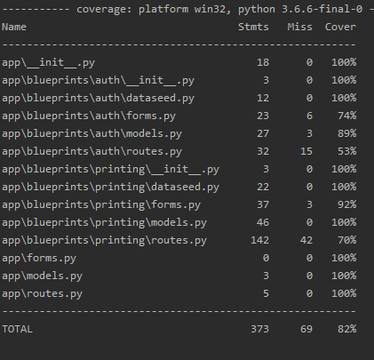

<!-- PRINTING PORTAL -->
#Printing Portal

<!-- TABLE OF CONTENTS -->
<details open="open">
  <summary><h2 style="display: inline-block">Table of Contents</h2></summary>
  <ol>
    <li>
      <a href="#about-the-project">About The Project</a>
      <ul>
        <li><a href="#built-with">Built With</a></li>
      </ul>
    </li>
    <li>
      <a href="#getting-started">Getting Started</a>
      <ul>
        <li><a href="#installation">Installation</a></li>
        <li><a href="#installation">Running The App</a></li>
        <li><a href="#installation">Running Unit Tests</a></li>
      </ul>
    </li>
    <li><a href="#roadmap">Roadmap / Kanban Board</a></li>
    <li><a href="#roadmap">Database Design</a></li>
    <li><a href="#license">License</a></li>
    <li><a href="#contact">Contact</a></li>
    <li><a href="#acknowledgements">Acknowledgements</a></li>
  </ol>
</details>


<!-- ABOUT THE PROJECT -->
## About The Project

This project was created as a simple solution for inventory management of art prints and other print related products. 
After login, the user can enter a new print order selecting from the database defined list of designs, paper types and sizes. The order can clear or checkout, at which the user can view the print order history and aggregate print inventory.

This web application was built with Flask blueprints and is designed to be modulary added to other Flask projects.


### Built With

* Flask, Flask-Login, Flask-WTF
* SQLAlchemy, MySQL
* Flask-Migrate


<!-- GETTING STARTED -->
## Getting Started

To get a local copy up and running follow these simple steps.

### Installation

1. Clone the repo:
   ```sh
   git clone https://github.com/OrigamiCranes/PrintingPortal.git
   ```
2. Install pip packages:
   ```sh
   pip install requirements.txt
   ```
3. Rename 'example_config.py' to 'config.py', update file variables; SQLALCHEMY_DATABASE_URI and SECRET_KEY
 
4. Run flask to update database schema:
   ```sh
   flask upgrade
   ```

### Running The App

1. If Windows use flask for development only:
    ```sh
   flask run -h localhost
   ```
2. If Linux use the superior gunicorn deployment:
   ```sh
   gunicorn --workers=2 --bind=0.0.0.0:5000 app:app
   ```
### Running Unit Tests

1. Run one of the pytest syntax's below:
   ```sh
   pytest --cov=app
   pytest --cov=app --cov-report term-missing
   pytest --cov=app --cov-report html
   ```

<!-- ROADMAP -->
## Roadmap / Kanban Board

This app was developed with an agile approach, the roadmap and kanban board can be found in the 
[projects section](https://github.com/OrigamiCranes/PrintingPortal/projects/1) on the github repo.

<!-- DATABASE DESIGN -->
## Database Design

### Printing ERD

The design of the printing ERD evolved over three iterations; MVP, V2 and V3. 

* MVP: Covers the PrintOrder form and viewable OrderHistory, along with three single column tables for system dependant variables.

* V2: Adds the PrintInventory to the ERD

* V3: **_(Future release)_** Creates a near identincal twin structure of V2, which allows the user to conduct paper orders for inventory tracking paper supplies. 




### Authentication ERD

The authentication section of the database is defined the same as the [Miguel Grinberg Flask-login tutorial.](https://blog.miguelgrinberg.com/post/the-flask-mega-tutorial-part-v-user-logins)




<!-- TEST COVERAGE -->
## Test Coverage
The unit testing assures that all routes are accessible, all database CRUD functions are working correctly and that any error values do not corrupt the database. The tests also check the formfactory outputs the correct forms.

Testing of route form requests was out of the scope of these tests due to the use of QuerySelectFields used in forms, which made direct testing impracticable. This was deemed acceptable as these sections of the code were essentially passing on variables to other route redirects, which have been tested directly.
 




<!-- LICENSE -->
## License

Distributed under the MIT License. See `LICENSE` for more information.


<!-- CONTACT -->
## Contact

Jack McKeon - coding@jackmckeon.co.uk

Project Link: [https://github.com/OrigamiCranes/PrintingPortal](https://github.com/OrigamiCranes/PrintingPortal)


<!-- ACKNOWLEDGEMENTS -->
## Acknowledgements

* QA Academy DevOps Fundamental Project

